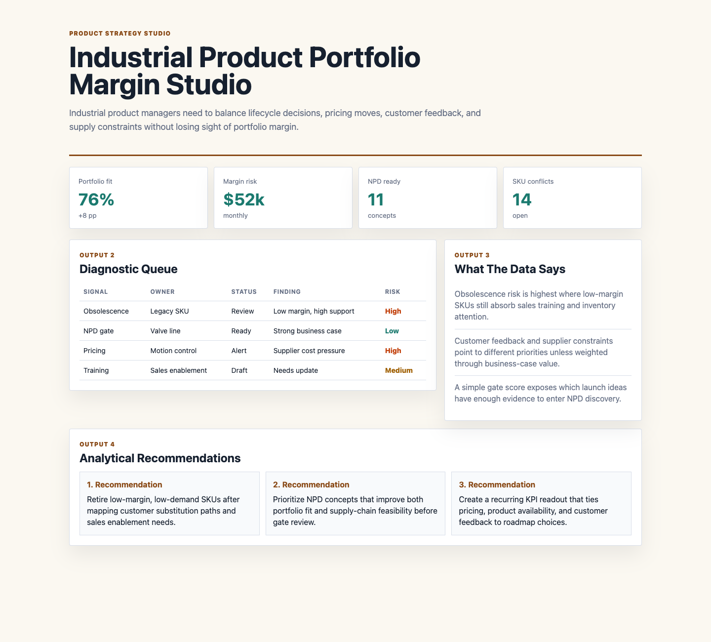

# Industrial Product Portfolio Margin Studio

## Motivation

Industrial product managers need to balance lifecycle decisions, pricing moves, customer feedback, and supply constraints without losing sight of portfolio margin.

This project is intentionally scoped as a practical decision artifact: it shows how I would organize source data, surface the operating signal, and turn the analysis into a recommendation that a product, analytics, or operations team could discuss immediately.

## What Is In The Project

- A browser-based analytical dashboard in `index.html`
- Source-style synthetic data in `data/`
- Analysis notes in `analysis/`
- A data dictionary in `data_dictionary.md`
- A rendered screenshot in `docs/images/dashboard.png`

## Data Inventory

- Six source-style CSVs back the project instead of a tiny sample dataset.
- The data folder now includes 2,880 daily metric records, 720 source events, 360 data-quality checks, and 90 recommended actions.
- The analysis folder includes a data profile and recommendations that explain how the evidence should drive product or operating decisions.
- The `scripts/score_operating_data.py` script ranks entity priorities and data-quality hotspots from the CSVs.

## What The Data Says

- Obsolescence risk is highest where low-margin SKUs still absorb sales training and inventory attention.
- Customer feedback and supplier constraints point to different priorities unless weighted through business-case value.
- A simple gate score exposes which launch ideas have enough evidence to enter NPD discovery.

## Analytical Recommendations

- Retire low-margin, low-demand SKUs after mapping customer substitution paths and sales enablement needs.
- Prioritize NPD concepts that improve both portfolio fit and supply-chain feasibility before gate review.
- Create a recurring KPI readout that ties pricing, product availability, and customer feedback to roadmap choices.

## Output Walkthrough

### Output 1: Executive Pulse

The KPI cards summarize the current operating condition and identify whether the team should trust, investigate, or act.

### Output 2: Diagnostic Queue

The table ranks the highest-priority signals by owner group, status, evidence, and risk.

### Output 3: Recommendation Memo

The recommendation section converts the dashboard into specific next moves for the operating team.

## Screenshot



## Run Locally

```bash
python3 -m http.server 4173
```

Then open `http://localhost:4173`.
