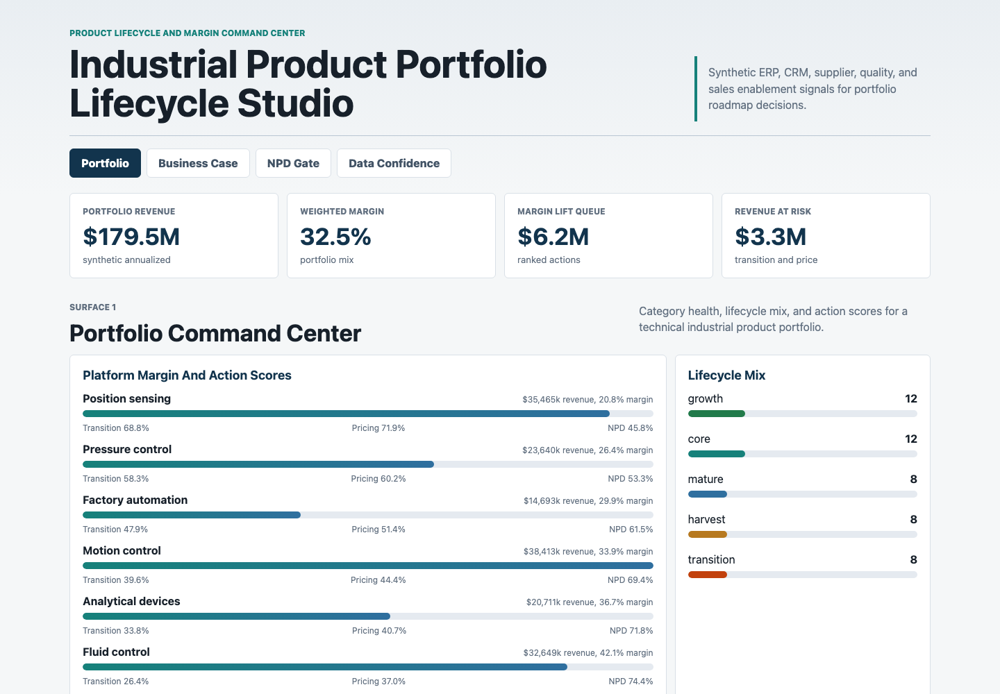
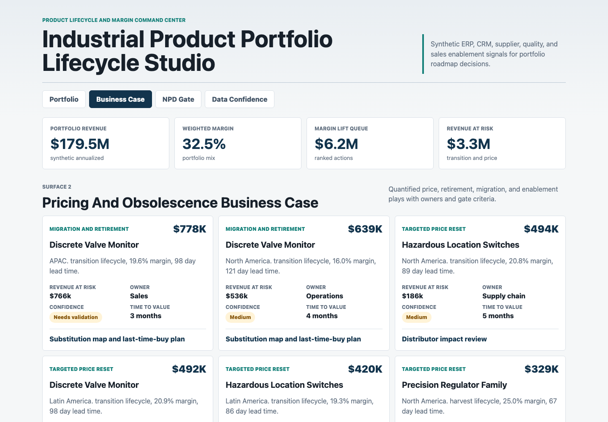
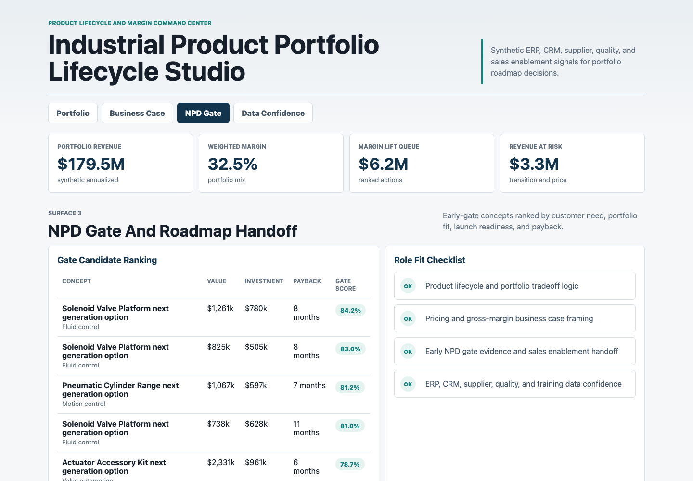

# Industrial Product Portfolio Lifecycle Studio

This portfolio artifact is a product-management decision studio for an industrial fluid, pneumatic, sensing, and motion-control portfolio. It shows how a product manager can combine lifecycle stage, margin, cost inflation, supplier constraints, customer need, service burden, CRM feedback, and launch readiness into a defensible portfolio roadmap.

The project is intentionally built as a decision artifact, not a generic KPI dashboard. It supports the kinds of product decisions made in a technical industrial portfolio review: which product families need a price reset, which legacy platforms should migrate or retire, which NPD concepts have enough evidence for early gates, and which data sources need validation before a roadmap call.

## Screenshots

### Portfolio Command Center



Caption: The first surface summarizes synthetic annualized portfolio revenue, weighted margin, margin lift, lifecycle mix, and the top product-family action queue.

### Pricing And Obsolescence Business Case



Caption: The second surface converts portfolio signals into quantified price, migration, retirement, and enablement cases with margin lift, revenue at risk, owners, confidence, and next gate criteria.

### NPD Gate And Roadmap Handoff



Caption: The third surface ranks early NPD concepts by customer need, portfolio fit, launch readiness, investment, payback, and evidence status.

## What Is In The Project

- A static browser artifact in `index.html`, `src/app.js`, `src/styles.css`, and `src/data.js`
- A deterministic synthetic data generator in `scripts/generate_portfolio_artifact.py`
- Four source-style CSV datasets in `data/`
- A generated browser payload in `analysis/outputs/app_payload.json`
- Analysis notes and SQL-style checks in `analysis/`
- A data dictionary in `data_dictionary.md`

## Data

The project uses synthesized data because SKU-level ERP, CRM, margin, supplier, quality, and sales enablement data for a real industrial automation portfolio is not public. The synthetic structure is modeled on public industrial automation portfolio patterns, including valves, pneumatics, regulators, actuators, sensors, controls, accessories, lifecycle states, distributor feedback, supplier lead times, warranty claims, and sales training readiness.

The generator uses a fixed random seed so the artifact is reproducible. It creates:

- `data/product_portfolio.csv`: 48 product-family and region rows with annualized revenue, gross margin, lifecycle stage, cost inflation, lead time, warranty drag, customer need, competitive pressure, service burden, substitution fit, launch readiness, and data confidence.
- `data/pricing_obsolescence_cases.csv`: 14 ranked price, migration, retirement, NPD, and enablement plays with margin lift, revenue at risk, owner, confidence, and gate criteria.
- `data/npd_gate_candidates.csv`: 10 early-stage roadmap concepts with estimated value, investment, payback, evidence status, and launch dependency.
- `data/source_quality_controls.csv`: 8 source controls across ERP, CRM, supplier, quality, training, roadmap, and distributor feedback inputs.

The scoring model is a lightweight PM decision model, not a predictive machine-learning model. It calculates transition urgency, pricing confidence, NPD gate score, and portfolio action score from weighted business inputs. This is meant to be explainable in a portfolio review.

## Role Connection

This artifact demonstrates product lifecycle management, product portfolio management, category understanding, pricing strategy, KPI interpretation, financial modeling, NPD gate thinking, sales enablement planning, and ERP/CRM source awareness. It is designed for a product manager responsible for technical industrial product lines, not for a pure BI reporting role.

## Scope

What it does:

- Turns synthetic product, margin, lifecycle, supplier, quality, CRM, and launch-readiness signals into ranked portfolio actions.
- Provides 4 distinct surfaces for portfolio review, business-case evaluation, NPD handoff, and data confidence.
- Documents the data-generation assumptions and scoring logic so the candidate can explain the artifact in an interview.

What it does not do:

- It does not represent real company performance.
- It does not use confidential SKU, customer, supplier, or pricing data.
- It does not forecast demand with a production ML model.
- It does not replace financial approval, customer discovery, or engineering feasibility review.

## Run Locally

```bash
python3 scripts/generate_portfolio_artifact.py
python3 -m http.server 4173
```

Then open `http://localhost:4173`.
